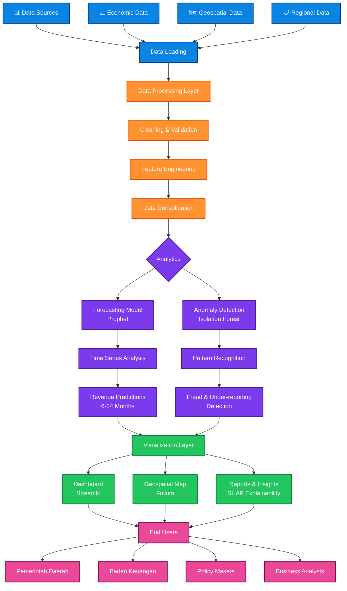
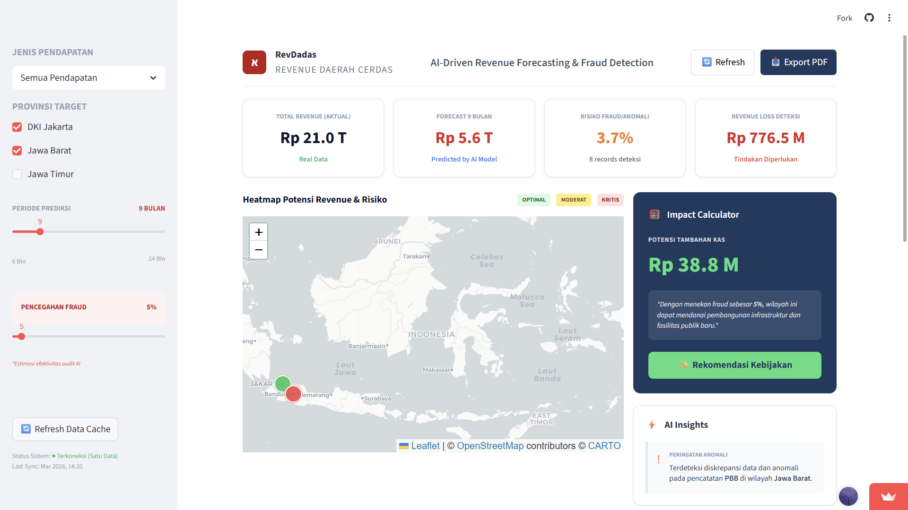

# RevDadas - Revenue Daerah Cerdas


Sistem analitik berbasis AI untuk deteksi fraud dan peramalan pendapatan pemerintah daerah.

[Tentang](#tentang-revdadas) • [Setup](#setup--installation) • [Live Demo](#live-demo) • [Screenshots](#screenshots) • [Tim](#tim)

---

## Tentang RevDadas

RevDadas adalah sistem untuk membantu pemerintah daerah dalam mendeteksi fraud pajak dan meramalkan pendapatan dengan lebih akurat. Kami menggunakan machine learning dan time series forecasting untuk:

- Mendeteksi anomali dalam data pendapatan
- Memprediksi revenue 6-24 bulan ke depan
- Memberikan rekomendasi kebijakan berbasis data
- Monitoring real-time melalui dashboard interaktif

Dibuat dengan Python, Prophet, dan Streamlit.

---

## Masalah
Banyak pemerintah daerah menghadapi masalah:
- under-reporting pajak
- fraud dalam pelaporan
- kesulitan memprediksi pendapatan
- monitoring yang tidak real-time

Hal ini menyebabkan kebijakan fiskal sering tidak optimal.
Revdadas hadir untuk mengatasi masalah tersebut menggunakan AI.

---

## Fitur

- **Deteksi Anomali** - Menangkap indikasi fraud menggunakan Isolation Forest
- **Forecasting** - Prediksi revenue dengan Prophet
- **Visualisasi Geospatial** - Peta heatmap untuk insights berbasis lokasi
- **Dashboard Interaktif** - Monitoring real-time dengan Streamlit
- **Rekomendasi Kebijakan** - Insights berbasis analisa data

Mendukung: Pajak Bumi dan Bangunan (PBB), Retribusi Pasar, Pajak Hotel & Restoran

---

## Arsitektur Sistem



---

Akses dashboard di sini: https://revdadas.streamlit.app/

Atau jalankan lokal:

```bash
cd revdadas/dashboard
streamlit run app.py
```

Dashboard akan buka di http://localhost:8501

---

## Screenshots



_Halaman utama dashboard_

---

## Setup & Installation

### Prerequisites

- Python 3.13+
- Git

### Virtual Environment

Windows:

```bash
python -m venv venv
venv\Scripts\activate
```

macOS/Linux:

```bash
python3 -m venv venv
source venv/bin/activate
```

### Install Dependencies

```bash
pip install -r requirements.txt
```

---

## Dataset

Data dari 3 provinsi: Jawa Barat, Jawa Timur, DKI Jakarta

Jenis pendapatan: PBB, Retribusi Pasar, Pajak Hotel & Restoran

Sumber data publik:

- BPS.go.id - https://www.bps.go.id/
- data.go.id - https://data.go.id/
- BIG.go.id - https://big.go.id/

Struktur:

```csv
Tahun,Bulan,Provinsi,Jenis_Pendapatan,Realisasi
2022,1,Jawa Barat,PBB,125600000000
2022,1,Jawa Barat,Retribusi Pasar,45300000000
```

---

## Struktur Proyek

```
revdadas/
├── data/
│   ├── raw/                   # Data mentah dari BPS
│   └── processed/             # Data terproses
│
├── src/
│   ├── data_loader.py
│   ├── preprocessing.py
│   ├── forecasting.py
│   ├── anomaly_detection.py
│   ├── utils.py
│   └── __init__.py
│
├── models/                    # Saved models
├── dashboard/
│   ├── app.py
│   ├── app_enhanced.py
│   └── app_backup.py
│
├── docs/
├── data_consolidation.py
├── requirements.txt
└── README.md
```

---

## Cara Menggunakan

### Jalankan Dashboard

```bash
cd revdadas
venv\Scripts\activate
cd dashboard
streamlit run app.py
```

Buka http://localhost:8501

### Training Forecasting Model

```python
from src import forecasting

forecaster = forecasting.RevenueForecaster(periods=12)
forecaster.train_and_forecast_all(df)

forecast = forecaster.forecast(
    provinsi='Jawa Barat',
    jenis_pajak='PBB'
)
print(forecast.head())
```

### Deteksi Anomali

```python
from src import anomaly_detection

detector = anomaly_detection.AnomalyDetector()
detector.train(df)
result = detector.detect(df)

insights = detector.get_anomaly_insights(result, threshold=0.7)
for insight in insights:
    print(insight['Alert'])
```

### Data Consolidation

```bash
python data_consolidation.py
```

---

## Tech Stack

| Library      | Versi  |
| ------------ | ------ |
| Pandas       | 2.1.4  |
| NumPy        | 1.24.3 |
| Prophet      | 1.1.5  |
| Scikit-learn | 1.4.2  |
| Plotly       | 5.18.0 |
| Streamlit    | 1.28.1 |
| Folium       | 0.14.0 |
| SHAP         | 0.43.0 |

---

## Tim

**Ketua**: Kwik Andreas Jonathan (322301113)

**Developer**:

- Clay Micholaz Fu
- Moses Chisthoper Adisam
- Gwyneth Eunice Widjaja

Tim mahasiswa dari Universitas Bunda Mulia

---

## Kontribusi

Terbuka untuk kontribusi. Fork, commit, dan buat pull request.

---

## License

MIT License

---

## Support

Untuk pertanyaan atau bug report, buka issue di repository ini.
