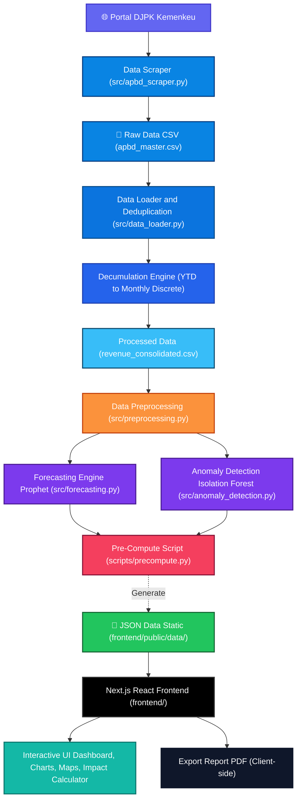
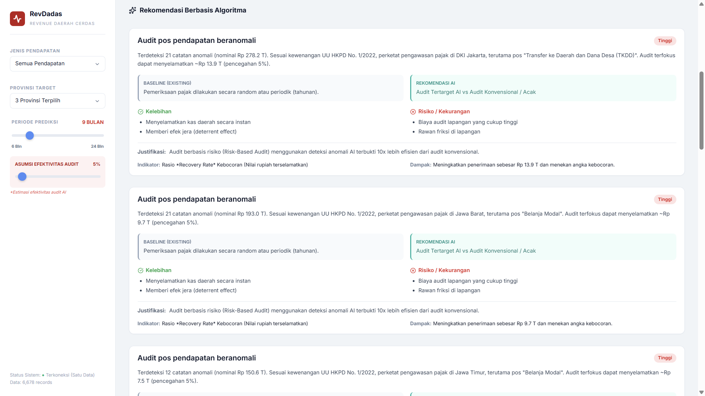
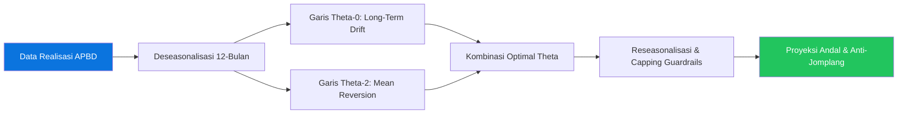
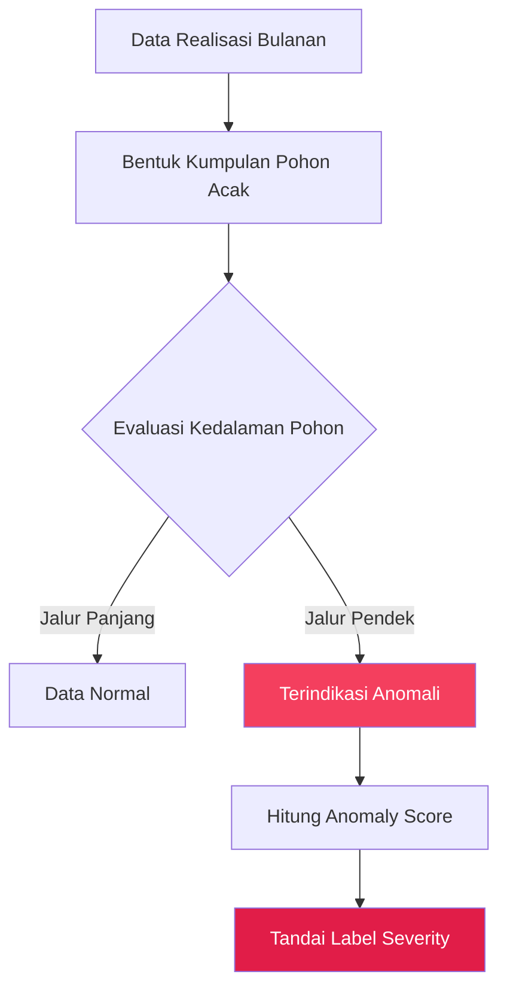

# RevDadas - Revenue Daerah Cerdas


Sistem analitik berbasis AI untuk deteksi anomali dan peramalan pendapatan pemerintah daerah.

[Tentang](#tentang-revdadas) • [Arsitektur](#arsitektur-sistem) • [Setup](#setup--installation) • [Screenshots](#demo-screenshots) • [Tim](#tim)

---

## Tentang RevDadas

RevDadas adalah sistem untuk membantu pemerintah daerah dalam mendeteksi anomali pendapatan dan meramalkan tren ke depan dengan lebih akurat. Kami menggunakan machine learning dan time series forecasting untuk:

- Mendeteksi anomali dalam data pendapatan
- Memprediksi revenue 6-24 bulan ke depan
- Memberikan rekomendasi kebijakan berbasis data
- Monitoring real-time melalui dashboard interaktif

---

## Masalah

Banyak pemerintah daerah menghadapi masalah dalam pengelolaan APBD:

- *under-reporting* pada Pendapatan Asli Daerah (PAD)
- anomali dan kejanggalan dalam pelaporan (potensi *fraud* / kesalahan data)
- kesulitan memprediksi tren pendapatan (PAD & TKDD) secara akurat
- monitoring kapasitas fiskal yang tidak *real-time*

Hal ini menyebabkan kebijakan fiskal sering tidak optimal. RevDadas hadir untuk mengatasi masalah tersebut menggunakan AI.

---

## Fitur

- **Automated Data Scraper** - Mengambil data APBD (2021-2025) secara otomatis dari portal DJPK Kemenkeu dengan rentang 14 taksonomi APBD granular.
- **Exploratory Data Analysis (EDA)** - Modul pembersihan data pintar (Winsorization) dan visualisasi distribusi historis pra-pemodelan.
- **Deteksi Anomali & Aggregate Isolation** - Menangkap indikasi data tidak wajar menggunakan *Isolation Forest* dengan kemampuan *Dynamic Aggregate Isolation* untuk mencegah penghitungan ganda.
- **Forecasting (Dual-Engine Architecture)** - Prediksi revenue 6-24 bulan dengan model utama **Theta Method (Primary)** yang parsimonious dan terbukti bebas overfitting/jomplang pada data runtun waktu pendek APBD, serta opsi cadangan **Prophet (Secondary)** untuk analisis pembanding komponen aditif.
- **Visualisasi Geospatial** - Peta heatmap cerdas berbasis lokasi Leaflet (OpenStreetMap).
- **Kalkulator Dampak (What-If)** - Mengkalkulasi metrik Potensi Kas dan Kemandirian Fiskal (Tahun Berjalan) melalui slider skenario interaktif.
- **Premium Executive Report** - Generator PDF tata kelola eksekutif dengan data *Top 5 Risiko Anomali* dan *Potensi Sektor Ekonomi Daerah*.
- **Dashboard Cepat (Next.js)** - *Loading* instan berkat pra-komputasi JSON

Mendukung: Pajak Bumi dan Bangunan (PBB), Retribusi Daerah, PAD Lainnya, TKDD, serta integrasi 14 komponen APBD se-Indonesia.

---

## Arsitektur Sistem


```mermaid
graph TD
    Z["🌐 Portal DJPK Kemenkeu"] --> S["Data Scraper (src/apbd_scraper.py)"]
    S --> A["📁 Raw Data CSV (apbd_master.csv)"]
    A --> B["Data Loader and Deduplication (src/data_loader.py)"]
    B --> B2["Decumulation Engine (YTD to Monthly Discrete)"]
    B2 --> C["Processed Data (revenue_consolidated.csv)"]
    C --> D["Data Preprocessing (src/preprocessing.py)"]
    
    D --> E["Forecasting Engine Prophet (src/forecasting.py)"]
    D --> F["Anomaly Detection Isolation Forest (src/anomaly_detection.py)"]

    E --> G["Pre-Compute Script (scripts/precompute.py)"]
    F --> G
    
    G -.->|Generate| H["📄 JSON Data Static (frontend/public/data/)"]

    H --> I["Next.js React Frontend (frontend/)"]
    I --> J["Interactive UI Dashboard, Charts, Maps, Impact Calculator"]
    I --> K["Export Report PDF (Client-side)"]

    style Z fill:#6366f1,stroke:#4338ca,stroke-width:2px,color:#fff
    style S fill:#0984e3,stroke:#003d82,stroke-width:2px,color:#fff
    style A fill:#0984e3,stroke:#003d82,stroke-width:2px,color:#fff
    style B fill:#0b74de,stroke:#084d8c,stroke-width:2px,color:#fff
    style B2 fill:#2563eb,stroke:#1e40af,stroke-width:2px,color:#fff
    style C fill:#38bdf8,stroke:#0c4a6e,stroke-width:2px,color:#fff
    style D fill:#fb923c,stroke:#c2410c,stroke-width:2px,color:#fff
    style E fill:#7c3aed,stroke:#4c1d95,stroke-width:2px,color:#fff
    style F fill:#7c3aed,stroke:#4c1d95,stroke-width:2px,color:#fff
    style G fill:#f43f5e,stroke:#881337,stroke-width:2px,color:#fff
    style H fill:#22c55e,stroke:#166534,stroke-width:2px,color:#fff
    style I fill:#000000,stroke:#333333,stroke-width:2px,color:#fff
    style J fill:#14b8a6,stroke:#0f766e,stroke-width:2px,color:#fff
    style K fill:#0f172a,stroke:#0f172a,stroke-width:2px,color:#fff
```

---

## Demo Screenshots


_Halaman utama dashboard_

_Halaman rekomendasi Berbasis Algoritma_

_Halaman historical revenue vs forecast_

_Halaman detail data logs forecast data_

_Halaman detail data logs anomalies_

_Halaman detail data logs akurasi model_

_Halaman detail data logs simulasi what if_

_Halaman detail data logs metodologi_

---

## Metodologi Analitik AI

RevDadas ditenagai oleh dua model *Machine Learning* utama yang dirancang khusus untuk menganalisis karakteristik keuangan daerah.

### 1. Peramalan Pendapatan (Dual-Engine Architecture: Theta Primary & Prophet Secondary)
RevDadas mengadopsi arsitektur peramalan ganda (*Dual-Engine*) untuk menjawab tantangan data fiskal APBD berhorizon pendek ($N=36$ titik):

#### A. Algoritma Utama: Theta Method (Primary Engine)
Model utama RevDadas menggunakan **Theta Method** (Assimakopoulos & Nikolopoulos), algoritma peramalan pemenang *M3 Forecasting Competition* yang diakui secara global memiliki performa superior pada deret waktu bulanan bersampel pendek ($N < 50$).

**Model Matematis (Theta Decomposition):**
Deret waktu $Y_t$ yang telah dide-seasonalisasi dipecah menjadi dua garis 𝜃:
$$
Z''_t(\theta) = \theta Y''_t
$$
- **$\theta_1 = 0$ (Long-Term Drift):** Menangkap tren linier deterministik jangka panjang makroekonomi wilayah.
- **$\theta_2 = 2$ (Mean-Reverting Curvature):** Menangkap dinamika dan kurvatur jangka pendek dengan memaksakan pergerakan kembali ke rata-rata (*mean-reversion*).
- Hasil gabungan kedua garis $\theta$ kemudian dire-seasonalisasi menggunakan indeks musiman bulanan klasik.


```mermaid
flowchart LR
    A[Data Realisasi APBD] --> B[Deseasonalisasi 12-Bulan]
    B --> C[Garis Theta-0: Long-Term Drift]
    B --> D[Garis Theta-2: Mean Reversion]
    C --> E[Kombinasi Optimal Theta]
    D --> E
    E --> F[Reseasonalisasi & Capping Guardrails]
    F --> G[Proyeksi Andal & Anti-Jomplang]
    
    style A fill:#0b74de,color:#fff
    style G fill:#22c55e,color:#fff
```

**Mengapa Theta Menjadi Pilihan Utama?**
1. **Bebas Overfitting (Parsimonious):** Berbeda dengan model kompleks yang memiliki puluhan parameter, Theta hanya menggunakan 2 parameter bebas sehingga kebal terhadap *overfitting* pada sampel 36 bulan.
2. **Anti-Jomplang:** Sifat *mean-reverting* mencegah proyeksi belanja/pendapatan meledak liar ke atas atau runtuh ke nol.
3. **Akurasi Empiris Tinggi:** Mengukir Median WAPE terendah (**15.88%** pada akun fiskal utama) dan waktu komputasi instan (< 1 detik untuk 112 deret).

#### B. Algoritma Cadangan: Prophet (Secondary Optional Engine)
RevDadas tetap mempertahankan **Prophet** sebagai opsi sekunder untuk evaluasi dekomposisi komponen tren aditif ($y(t) = g(t) + s(t) + h(t) + \epsilon_t$). Model ini dapat diaktifkan kapan saja melalui parameter CLI untuk pengujian A/B.

**Mekanisme Pelindung Keandalan Data (*Data Guardrail*)**
Sistem dilengkapi evaluasi *backtesting* terotomatisasi (WAPE & sMAPE holdout 6 bulan) serta batas pengaman (*guardrail clamp* non-negatif dan plafon $1.35 \times \text{Max Historis}$) untuk menjamin proyeksi tetap dalam koridor fiskal yang realistis.

### 2. Deteksi Anomali (Isolation Forest)
Untuk mendeteksi laporan pendapatan yang tidak wajar (indikasi pelaporan *under-reporting*, salah catat, atau *fraud*), kami menerapkan algoritma **Isolation Forest**. Algoritma ini tidak mempelajari pola normal, melainkan secara eksplisit **mengisolasi data yang menyimpang**.
*(Update Patch: Ekstraksi fitur kini dikelompokkan secara spesifik per seri **Provinsi + Jenis Pendapatan** agar deteksi MoM (Month-over-Month) dan pergerakan rata-rata tidak mencampuradukkan sumber pendapatan yang berbeda, sehingga tingkat deteksi anomali jauh lebih presisi)*.

**Cara Kerja Algoritma:**
1. Sistem mengekstraksi 4 fitur utama per seri (Normalisasi Revenue, MoM Change, Rasio MA-3, dan Deviasi Musiman).
2. Sistem membangun sekumpulan pohon keputusan acak (*Isolation Trees*).
3. Data yang bersifat anomali lebih mudah terpisah dari kelompoknya, sehingga memiliki lintasan pemisahan (*path length*) yang sangat pendek.
4. Skor anomali dihitung. Jika terdeteksi jalur tidak wajar, data diklasifikasikan dengan label **Tinggi** atau **Sedang** beserta diagnosis jenis anomali.


```mermaid
flowchart TD
    A[Data Realisasi Bulanan] --> B[Bentuk Kumpulan Pohon Acak]
    B --> C{Evaluasi Kedalaman Pohon}
    C -->|Jalur Panjang| D[Data Normal]
    C -->|Jalur Pendek| E[Terindikasi Anomali]
    E --> F[Hitung Anomaly Score]
    F --> G[Tandai Label Severity]
    
    style E fill:#f43f5e,color:#fff
    style G fill:#e11d48,color:#fff
```

> **Contoh Deteksi Anomali (Isolation Forest):**
> * **Objek Observasi:** Provinsi Bali — Komponen Belanja Modal
> * **Periode Terdeteksi:** Februari 2025
> * **Nilai Realisasi:** Rp 14,14 Miliar
> * **Matriks Fitur (Feature Extraction):** Terjadi deviasi ekstrem dengan nilai `YoY_Growth` terkontraksi pada level -98,28%, berbanding terbalik dengan nilai `MoM_Change` yang mengalami lonjakan (*spike*) sebesar +69.912,8%.
> * **Hasil Klasifikasi:** `Severity: Sedang` | `Indikasi: Spike / Manipulasi`
> * **Justifikasi Mesin:** Terdeteksi lonjakan logaritmik eksponensial secara bulanan (MoM) meskipun persentase penyerapan total terhadap pagu anggaran riil (0,2%) tidak berkorelasi dengan volatilitas tersebut.

### 3. Simulasi Output Metrik Dashboard (Kasus 3 Provinsi)
Berikut adalah *snapshot* log sistem yang mendemonstrasikan kalkulasi final dari layar *dashboard* (pasca-kalibrasi agregat *Current Year*) ketika melakukan *stress-test* pada tiga provinsi berpendapatan terbesar di Indonesia secara bersamaan.

```text
================ DEBUG INFO ================
[SUMMARY] KINERJA UTAMA (KPI)
Total Revenue                 : Rp 330.1 T
Forecast 9 Bulan              : Rp 293.1 T
Risiko Anomali                : 6.1% (13 records dianalisis)
Revenue Loss Deteksi          : Rp 20.1 T
Kemandirian Fiskal            : 44.3%
Potensi Penyelamatan Arus Kas : Rp 1.0 T

[MODULE] HISTORICAL REVENUE VS FORECAST (ENSEMBLE AI)
Periode  | Realisasi (Hist)  | Prediksi (Forecast) | Bounds (95% CI)
2025-01  | Rp 28.2 T         | -                   | -
2025-02  | Rp 31.0 T         | -                   | -
2025-03  | Rp 33.1 T         | -                   | -
...
2025-10  | -                 | Rp 32.5 T           | Rp 29.1 T - Rp 35.8 T
2025-11  | -                 | Rp 34.1 T           | Rp 30.0 T - Rp 37.9 T

[MODULE] PROPORSI SUMBER PENDAPATAN
1. Pajak Daerah              : Rp 180.5 T [|||||||||||||||||   ] 54.6%
2. Transfer Pemerintah Pusat : Rp 120.2 T [|||||||||||         ] 36.4%
3. Lain-lain PAD yang Sah    : Rp  29.4 T [||                  ]  8.9%

[MODULE] DETAIL DATA LOGS

> TAB: FORECAST DATA
Tanggal    | Provinsi     | Jenis Pendapatan  | Prediksi     | Metode
2025-10-01 | DKI Jakarta  | Pajak Daerah      | Rp 15.2 T    | Ensemble (Prophet+Naive)
2025-10-01 | Jawa Barat   | Pajak Daerah      | Rp  9.1 T    | Prophet-only
2025-10-01 | Jawa Timur   | Pajak Daerah      | Rp  8.2 T    | Ensemble (Prophet+Naive)

> TAB: ANOMALIES
Tanggal    | Provinsi     | Jenis Pendapatan  | Realisasi    | Severity
2025-01-01 | Jawa Barat   | Belanja Modal     | Rp  2.1 T    | Tinggi (Spike)
2025-03-01 | DKI Jakarta  | Pendapatan Hibah  | Rp  0.8 T    | Sedang (Outlier)

> TAB: AKURASI MODEL (WAPE)
Provinsi     | Jenis Pendapatan         | Akurasi | WAPE  | Keandalan
DKI Jakarta  | Pajak Daerah             | 85.2%   | 14.8% | 🟢 Andal
Jawa Barat   | Transfer Antar Daerah    | 62.1%   | 37.9% | 🟡 Cukup
Jawa Timur   | Belanja Tidak Terduga    | 12.5%   | 87.5% | 🔴 Lemah (Sinyal Tidak Cukup)

================ Pengaturan ================
Jenis Pendapatan : Semua Pendapatan
Provinsi Target  : DKI Jakarta, Jawa Barat, Jawa Timur
Periode Prediksi : 9 Bulan
Pencegahan Anomali : 5%
============================================
```

---

## Setup & Installation

Untuk menjalankan sistem ini, Anda perlu menjalankan proses **Backend (Python)** untuk merender *Machine Learning* dan **Frontend (Node.js)** untuk menjalankan UI web.

### 1. Prerequisites
- Python 3.13+
- Node.js 18+ (disarankan Node.js 20+)
- Git

### 2. Backend (Pre-compute AI Models)
Latih model kecerdasan buatan untuk mengomputasi data statis JSON.

```bash
# Buat Virtual Environment
python -m venv venv

# Aktifkan (Windows)
venv\Scripts\activate
# Atau aktifkan (macOS/Linux)
source venv/bin/activate

# Install dependensi
pip install -r requirements.txt

# Jalankan scraper data APBD (Opsional jika data raw belum ada)
python src/apbd_scraper.py

# Jalankan konsolidasi data APBD
python data_consolidation.py

# 1. Jalankan komputasi dengan Theta Method (Primary Engine - Default):
python scripts/precompute.py --model theta

# 2. Atau jika ingin mengomputasi Prophet (Secondary Engine):
python scripts/precompute.py --model prophet

# 3. Atau ingin switch instan antara model (< 0.1 detik dari cache tanpa re-train):
python scripts/precompute.py --switch theta
python scripts/precompute.py --switch prophet
```
> Data JSON akan ter-ekstrak otomatis ke folder `frontend/public/data/` (dan paket terisolasi di `frontend/public/data/models/`).

### 3. Frontend (Web Dashboard Next.js)
Jalankan antarmuka interaktif yang akan mengonsumsi data JSON tersebut.

```bash
# Masuk ke folder frontend
cd frontend

# Install package Node
npm install

# Jalankan server
npm run dev
```

Dashboard sekarang bisa diakses pada browser di: **http://localhost:3000**

---

## Struktur Proyek

```
revdadas/
├── data/
│   ├── raw/                   # Data mentah (dari DJPK Kemenkeu & BPS)
│   └── processed/             # Data terproses (hasil data_consolidation)
│
├── src/                       # Logika AI & Machine Learning Python
│   ├── apbd_scraper.py        # Scraper otomatis data APBD dari portal DJPK
│   ├── data_loader.py
│   ├── preprocessing.py
│   ├── forecasting.py
│   ├── anomaly_detection.py
│   ├── business.py
│   └── policy.py
│
├── scripts/
│   └── precompute.py          # Script utama yang menghubungkan ML ke JSON Next.js
│
├── frontend/                  # Modern Web Dashboard (Next.js + React)
│   ├── src/app/               # Main Pages
│   ├── src/components/        # UI Components (Charts, Tables, Maps, Calculator)
│   └── public/data/           # Output direktori dari precompute.py (JSON)
│
├── data_consolidation.py      # Pengolah data mentah -> data terproses
├── requirements.txt           # Python dependencies
└── README.md
```

---

## Tech Stack Terkini

**Frontend (Web UI)**
- Next.js (App Router)
- React 19
- Recharts (Visualisasi Data)
- React-Leaflet (Pemetaan)
- Vanilla CSS Modules
- jsPDF & jspdf-autotable (Export Laporan Premium)

**Backend (AI / Data Processing)**
- Python 3.13
- Pandas / Numpy
- Prophet (Time Series Forecasting)
- Scikit-Learn (Isolation Forest)

---

## Tim

**Ketua**: Kwik Andreas Jonathan (32230111)

**Developer**:
- Clay Micholaz Fu (32240207)
- Moses Chisthoper Adisam (32250047)
- Gwyneth Eunice Widjaja (32240119)

Tim mahasiswa dari Universitas Bunda Mulia

---

## License
MIT License