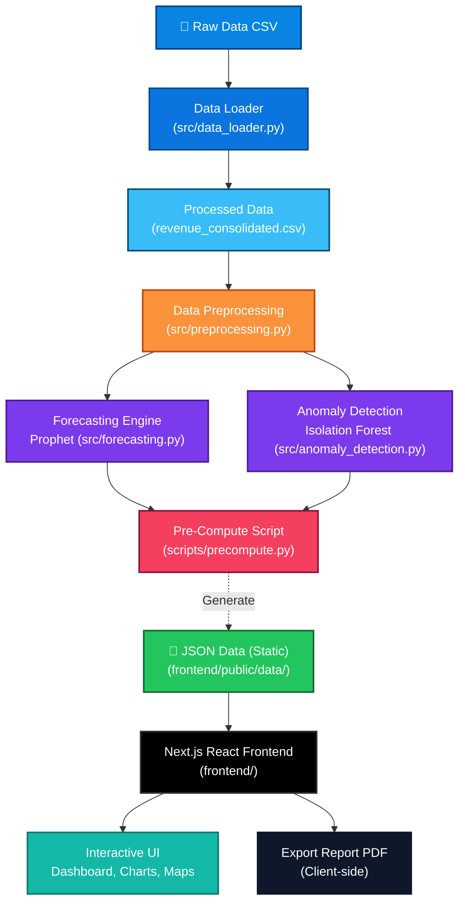
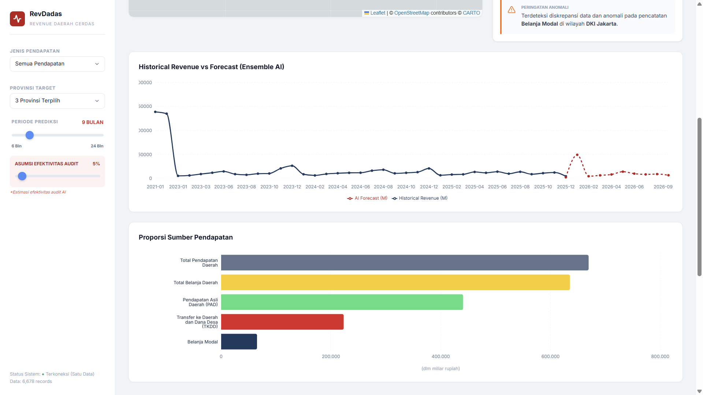
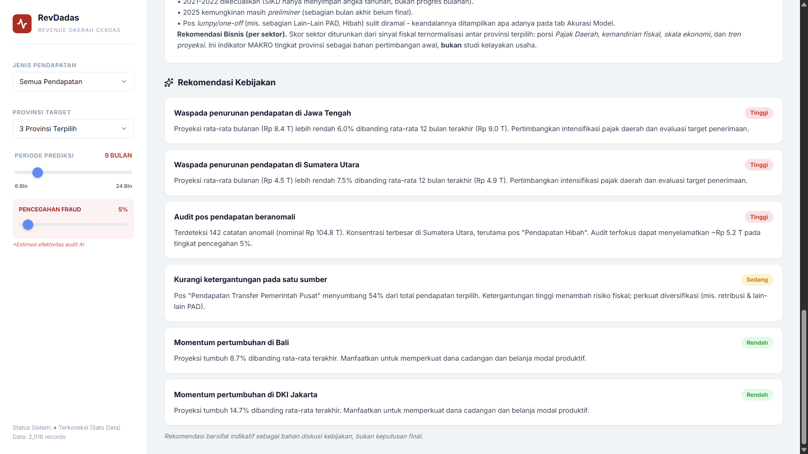
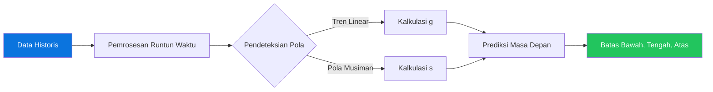
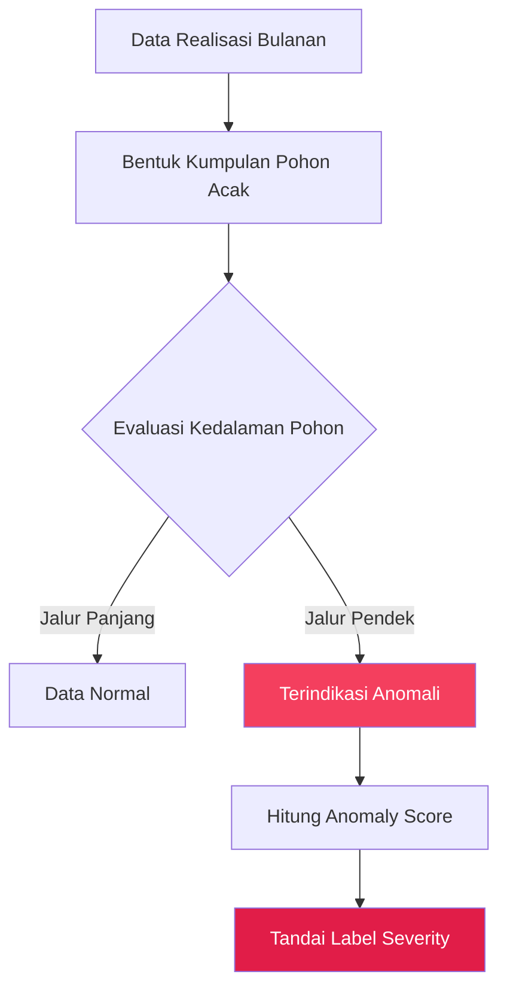

# RevDadas - Revenue Daerah Cerdas


Sistem analitik berbasis AI untuk deteksi fraud dan peramalan pendapatan pemerintah daerah.

[Tentang](#tentang-revdadas) • [Arsitektur](#arsitektur-sistem) • [Setup](#setup--installation) • [Screenshots](#demo-screenshots) • [Tim](#tim)

---

## Tentang RevDadas

RevDadas adalah sistem untuk membantu pemerintah daerah dalam mendeteksi fraud pajak dan meramalkan pendapatan dengan lebih akurat. Kami menggunakan machine learning dan time series forecasting untuk:

- Mendeteksi anomali dalam data pendapatan
- Memprediksi revenue 6-24 bulan ke depan
- Memberikan rekomendasi kebijakan berbasis data
- Monitoring real-time melalui dashboard interaktif

**Versi Eksperimental**: Proyek ini merupakan hasil migrasi dari Streamlit ke **Next.js**. Semua komputasi AI (*Prophet* & *Isolation Forest*) kini dijalankan di balik layar (*Precomputed*) menjadi berkas JSON statis. Hal ini memungkinkan antarmuka web (Frontend) dimuat dalam hitungan milidetik karena beroperasi tanpa memerlukan *backend server* (*Stateless/Serverless*).

---

## Masalah

Banyak pemerintah daerah menghadapi masalah:

- under-reporting pajak
- fraud dalam pelaporan
- kesulitan memprediksi pendapatan
- monitoring yang tidak real-time

Hal ini menyebabkan kebijakan fiskal sering tidak optimal. Revdadas hadir untuk mengatasi masalah tersebut menggunakan AI.

---

## Fitur

- **Deteksi Anomali** - Menangkap indikasi fraud menggunakan *Isolation Forest*
- **Forecasting** - Prediksi revenue dengan *Prophet* (Ensemble Model)
- **Visualisasi Geospatial** - Peta heatmap cerdas berbasis lokasi Leaflet
- **Kalkulator Dampak** - Mengkalkulasi potensi kas yang bisa diselamatkan
- **Rekomendasi Kebijakan** - Otomatis mendeteksi target sektor bisnis
- **Dashboard Cepat (Next.js)** - *Loading* instan berkat pra-komputasi JSON

Mendukung: Pajak Bumi dan Bangunan (PBB), Retribusi Pasar, Pajak Hotel & Restoran

---

## Arsitektur Sistem


```mermaid
graph TD
    A["📁 Raw Data CSV"] --> B["Data Loader\n(src/data_loader.py)"]
    B --> C["Processed Data\n(revenue_consolidated.csv)"]
    C --> D["Data Preprocessing\n(src/preprocessing.py)"]
    
    D --> E["Forecasting Engine\nProphet (src/forecasting.py)"]
    D --> F["Anomaly Detection\nIsolation Forest (src/anomaly_detection.py)"]

    E & F --> G["Pre-Compute Script\n(scripts/precompute.py)"]
    
    G -.->|Generate| H["📄 JSON Data (Static)\n(frontend/public/data/)"]

    H --> I["Next.js React Frontend\n(frontend/)"]
    I --> J["Interactive UI\nDashboard, Charts, Maps"]
    I --> K["Export Report PDF\n(Client-side)"]

    style A fill:#0984e3,stroke:#003d82,stroke-width:2px,color:#fff
    style B fill:#0b74de,stroke:#084d8c,stroke-width:2px,color:#fff
    style C fill:#38bdf8,stroke:#0c4a6e,stroke-width:2px,color:#fff
    style D fill:#fb923c,stroke:#c2410c,stroke-width:2px,color:#fff
    style E fill:#7c3aed,stroke:#4c1d95,stroke-width:2px,color:#fff
    style F fill:#7c3aed,stroke:#4c1d95,stroke-width:2px,color:#fff
    style G fill:#f43f5e,stroke:#881337,stroke-width:2px,color:#fff
    style H fill:#22c55e,stroke:#166534,stroke-width:2px,color:#fff
    style I fill:#000000,stroke:#333333,stroke-width:2px,color:#fff
    style J fill:#14b8a6,stroke:#0f766e,stroke-width:2px,color:#fff
    style K fill:#0f172a,stroke:#0f172a,stroke-width:2px,color:#fff
```

---

## Demo Screenshots


_Halaman utama dashboard_

_Halaman historical revenue vs forecast_

_Halaman detail data logs forecast data_

_Halaman detail data logs anomalies_

_Halaman detail data logs akurasi model_

_Halaman detail data logs rekomendasi bisnis_

_Halaman detail data logs simulasi what if_

_Halaman detail data logs metodologi_

_Halaman rekomendasi kebijakan_

---

## Metodologi Analitik AI

RevDadas ditenagai oleh dua model *Machine Learning* utama yang dirancang khusus untuk menganalisis karakteristik keuangan daerah.

### 1. Peramalan Pendapatan (Prophet)
Kami menggunakan model **Prophet** yang sangat tangguh dalam menangani data runtun waktu (*time-series*) yang memiliki pola musiman berulang (seperti pembayaran pajak di bulan tertentu) dan hari libur.

**Model Matematis (Decomposable Time Series):**

$$
y(t) = g(t) + s(t) + h(t) + \epsilon_t
$$

- $g(t)$ : Tren pertumbuhan (*growth*) jangka panjang non-periodik.
- $s(t)$ : Perubahan musiman (*seasonality*) tahunan/bulanan.
- $h(t)$ : Efek kalender / hari libur tidak beraturan.
- $\epsilon_t$ : Margin ketidakpastian (*noise*).


```mermaid
flowchart LR
    A[Data Historis] --> B[Pemrosesan Runtun Waktu]
    B --> C{Pendeteksian Pola}
    C -->|Tren Linear| D[Kalkulasi g]
    C -->|Pola Musiman| E[Kalkulasi s]
    D & E --> F[Prediksi Masa Depan]
    F --> G[Batas Bawah, Tengah, Atas]
    
    style A fill:#0b74de,color:#fff
    style G fill:#22c55e,color:#fff
```

### 2. Deteksi Anomali / Fraud (Isolation Forest)
Untuk mendeteksi laporan pendapatan yang tidak wajar (indikasi pelaporan *under-reporting* atau *fraud*), kami menerapkan algoritma **Isolation Forest**. Algoritma ini tidak mempelajari pola normal, melainkan secara eksplisit **mengisolasi data yang menyimpang**.

**Cara Kerja Algoritma:**
1. Sistem membangun sekumpulan pohon keputusan acak (*Isolation Trees*).
2. Data yang bersifat anomali lebih mudah terpisah dari kelompoknya, sehingga memiliki lintasan pemisahan (*path length*) yang sangat pendek.
3. Skor anomali dihitung. Jika skor mendeteksi jalur yang tidak wajar, data diklasifikasikan sebagai tingkat keparahan **Tinggi** atau **Sedang**.


```mermaid
flowchart TD
    A[Data Realisasi Bulanan] --> B[Bentuk Kumpulan Pohon Acak]
    B --> C{Evaluasi Kedalaman Pohon}
    C -->|Jalur Panjang| D[Data Normal]
    C -->|Jalur Pendek| E[Terindikasi Anomali]
    E --> F[Hitung Anomaly Score]
    F --> G[Tandai Label Severity]
    
    style E fill:#f43f5e,color:#fff
    style G fill:#e11d48,color:#fff
```

---

## Setup & Installation

Untuk menjalankan sistem ini, Anda perlu menjalankan proses **Backend (Python)** untuk merender *Machine Learning* dan **Frontend (Node.js)** untuk menjalankan UI web.

### 1. Prerequisites
- Python 3.13+
- Node.js 18+ (disarankan Node.js 20+)
- Git

### 2. Backend (Pre-compute AI Models)
Latih model kecerdasan buatan untuk mengomputasi data statis JSON.

```bash
# Buat Virtual Environment
python -m venv venv

# Aktifkan (Windows)
venv\Scripts\activate
# Atau aktifkan (macOS/Linux)
source venv/bin/activate

# Install dependensi
pip install -r requirements.txt

# Jalankan konsolidasi & komputasi AI
python data_consolidation.py
python scripts/precompute.py
```
> Data JSON akan ter-ekstrak otomatis ke folder `frontend/public/data/`.

### 3. Frontend (Web Dashboard Next.js)
Jalankan antarmuka interaktif yang akan mengonsumsi data JSON tersebut.

```bash
# Masuk ke folder frontend
cd frontend

# Install package Node
npm install

# Jalankan server
npm run dev
```

Dashboard sekarang bisa diakses pada browser di: **http://localhost:3000**

---

## Struktur Proyek

```
revdadas/
├── data/
│   ├── raw/                   # Data mentah dari BPS
│   └── processed/             # Data terproses (hasil data_consolidation)
│
├── src/                       # Logika AI & Machine Learning Python
│   ├── data_loader.py
│   ├── preprocessing.py
│   ├── forecasting.py
│   ├── anomaly_detection.py
│   ├── business.py
│   └── policy.py
│
├── scripts/
│   └── precompute.py          # Script utama yang menghubungkan ML ke JSON Next.js
│
├── frontend/                  # Modern Web Dashboard (Next.js + React)
│   ├── src/app/               # Main Pages
│   ├── src/components/        # UI Components (Charts, Tables, Leaflet Maps)
│   └── public/data/           # Output direktori dari precompute.py (JSON)
│
├── data_consolidation.py      # Pengolah data mentah -> data terproses
├── requirements.txt           # Python dependencies
└── README.md
```

---

## Tech Stack Terkini

**Frontend (Web UI)**
- Next.js (App Router)
- React 19
- Recharts (Visualisasi Data)
- React-Leaflet (Pemetaan)
- Vanilla CSS Modules
- html2pdf.js

**Backend (AI / Data Processing)**
- Python 3.13
- Pandas / Numpy
- Prophet (Time Series Forecasting)
- Scikit-Learn (Isolation Forest)

---

## Tim

**Ketua**: Kwik Andreas Jonathan (32230111)

**Developer**:
- Clay Micholaz Fu (32240207)
- Moses Chisthoper Adisam (32250047)
- Gwyneth Eunice Widjaja (32240119)

Tim mahasiswa dari Universitas Bunda Mulia

---

## License
MIT License
